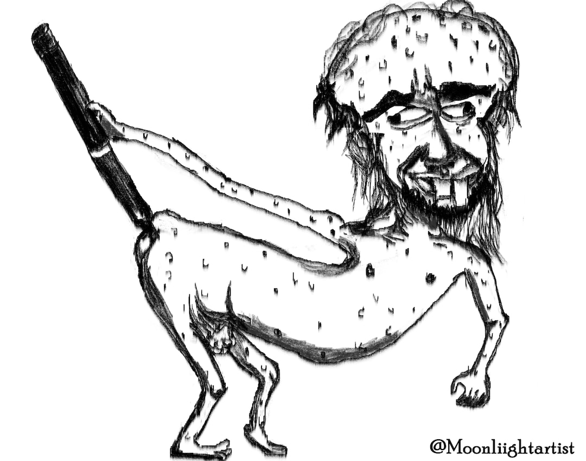

# Nutri-Kids

Bem-vindo ao **Nutri-Kids**! Este é um jogo educativo desenvolvido em **JavaScript** e **HTML** com o objetivo de ensinar crianças sobre alimentação saudável de uma forma divertida e interativa.
  

---

## 🎮 Sobre o jogo

Nutri-Kids é projetado para:

- **Educar** crianças sobre a importância de uma alimentação equilibrada.
- **Encorajar** escolhas alimentares saudáveis através de atividades lúdicas.
- **Ensinar** sobre diferentes grupos alimentares e seus benefícios.

Os jogadores interagem com diferentes alimentos e precisam fazer escolhas saudáveis para ganhar pontos e desbloquear novos níveis.

---

## 📚 Tecnologias Utilizadas

- **HTML5**: Estrutura do jogo.
- **CSS**: Estilização do design e elementos visuais.
- **JavaScript**: Lógica do jogo e interatividade.

---

## 🔧 Como executar o projeto

1. Clone o repositório:

   ```bash
   git clone https://github.com/Tiagos121/Nutri-Kids/ -b master
   ```

2. Navegue até o diretório do projeto:

   ```bash
   cd nutri-kids
   ```

3. Abra o arquivo `index.html` em seu navegador.

---

## 🔬 Funcionalidades

- **Escolhas alimentares**: Identifique alimentos saudáveis e ganhe pontos.
- **Personagens divertidos**: Guias que ajudam as crianças durante o jogo.

---

## 💡 Contribuindo

Adoramos contribuições! Se você quiser ajudar a melhorar o Nutri-Kids, siga estas etapas:

1. Fork o repositório.
2. Crie uma branch para sua funcionalidade/bug fix:
   ```bash
   git checkout -b minha-branch
   ```
3. Envie suas alterações:
   ```bash
   git commit -m "Minha contribuição"
   git push origin minha-branch
   ```
4. Abra um Pull Request.

---

## 🌐 Demo

Acesse a versão demo do Nutri-Kids [clicando aqui](https://valdirprogramacoes.pt/projetos/project_1736366895_677edb2f9d0a7/src/).

---

## 🌿 Licença

Este projeto está licenciado sob a [Licença MIT](LICENSE).

---

## 😊 Agradecimentos

Agradecemos a todos os contribuidores, jogadores e educadores que ajudaram a tornar o Nutri-Kids uma realidade. Seu suporte faz a diferença!

---

**Vamos construir um futuro mais saudável para as crianças, juntos!**

